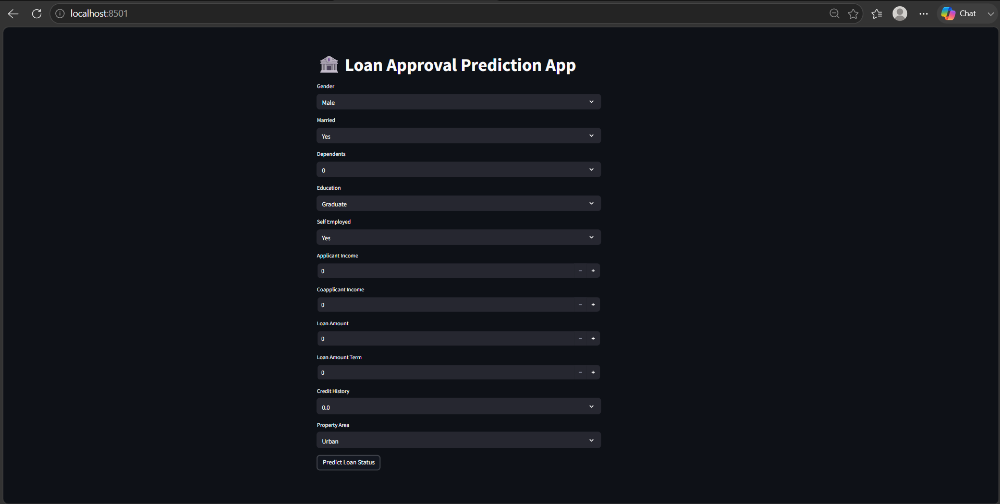
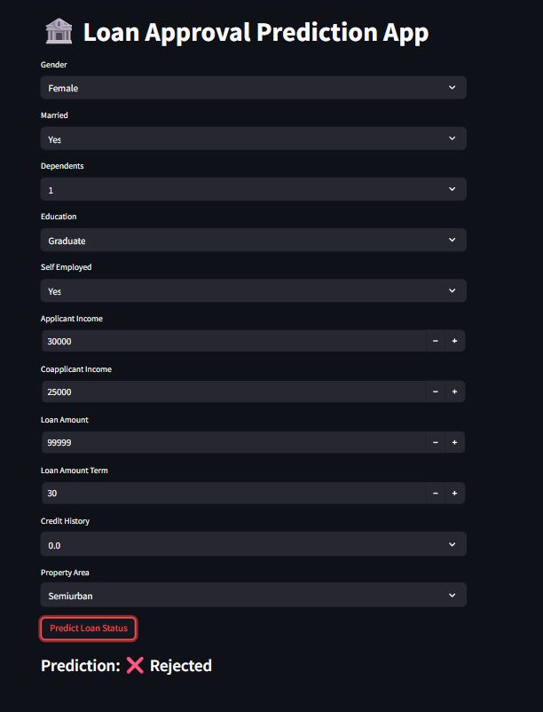

# Loan Approval Prediction System

## Overview

Financial institutions receive thousands of loan applications, making manual approval processes time-consuming and prone to inconsistencies. This project leverages Machine Learning to predict whether a loan application is likely to be approved based on applicant demographics, financial information, and credit history.

A Random Forest Classifier was trained on historical loan application data, achieving an accuracy of 95%. The trained model is integrated into a Streamlit web application, allowing users to make real-time predictions through an interactive interface.

## Key Features

* Automated loan approval prediction
* Random Forest-based classification model
* Data preprocessing and feature encoding
* Interactive Streamlit web application
* Real-time prediction results
* Model persistence using Pickle

## Technology Stack

### Programming Language

* Python

### Machine Learning

* Scikit-learn
* Random Forest Classifier

### Data Processing

* Pandas
* NumPy

### Visualization & Analysis

* Matplotlib
* Seaborn

### Deployment Interface

* Streamlit

### Model Serialization

* Pickle

## Dataset Features

| Feature           | Description           |
| ----------------- | --------------------- |
| Gender            | Applicant Gender      |
| Married           | Marital Status        |
| Dependents        | Number of Dependents  |
| Education         | Education Level       |
| Self_Employed     | Employment Type       |
| ApplicantIncome   | Applicant Income      |
| CoapplicantIncome | Co-applicant Income   |
| LoanAmount        | Loan Amount Requested |
| Loan_Amount_Term  | Loan Duration         |
| Credit_History    | Credit History Status |
| Property_Area     | Property Location     |
| Loan_Status       | Target Variable       |

## Machine Learning Workflow

1. Data Collection
2. Data Cleaning
3. Handling Missing Values
4. Label Encoding for Categorical Features
5. Feature Selection
6. Model Training using Random Forest Classifier
7. Model Evaluation
8. Model Saving and Deployment
9. Streamlit Integration

## Model Performance

| Metric   | Score |
| -------- | ----- |
| Accuracy | 95%   |

The model demonstrated strong predictive performance with balanced precision and recall, making it suitable for loan approval classification tasks.

## Future Enhancements

* Hyperparameter Optimization
* XGBoost Implementation
* Model Explainability using SHAP
* Cloud Deployment
* Loan Risk Scoring Dashboard

## Application Preview

### Input Form

### Prediction Result

## Author

Asvithaa K
Aspiring Data Scientist | Machine Learning Enthusiast
